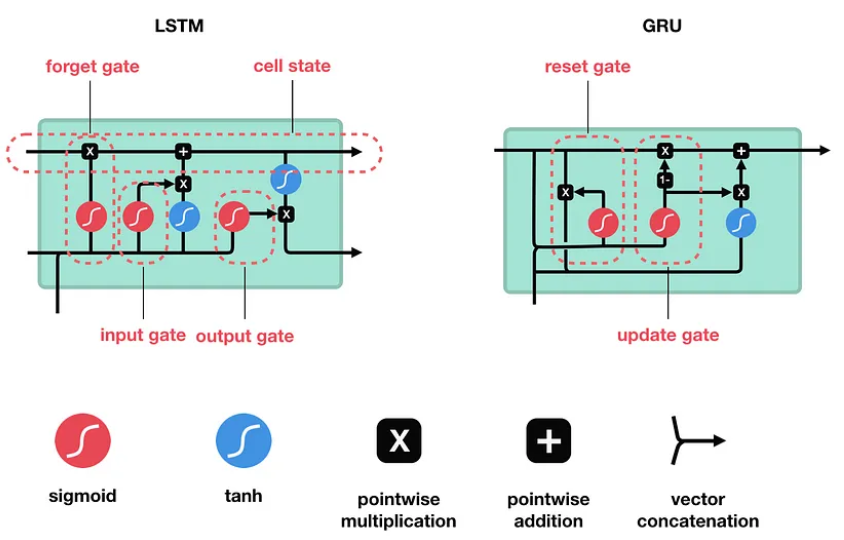
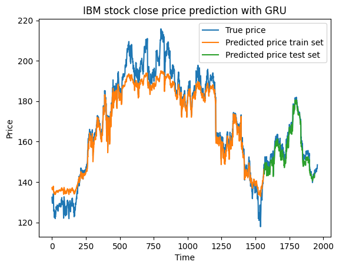

# LSTM and GRU
Aim: building a Long Short Term Memory network (LSTM) and Gated Recurrent Unit network for predicting IBM closing stock price over time.

Method:

+ Daily IBM closing stock price between 2010 and 2017 were used for training and test.

+ Samples of sequences of 20 consecutive daily prices are fed into LSTM/GRU network

+ LSTM and GRU network are constructed using the following structures:

Result:

