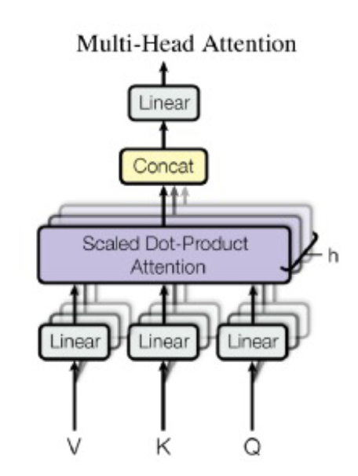
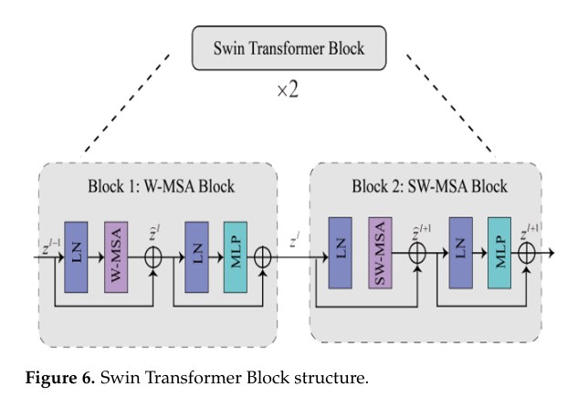
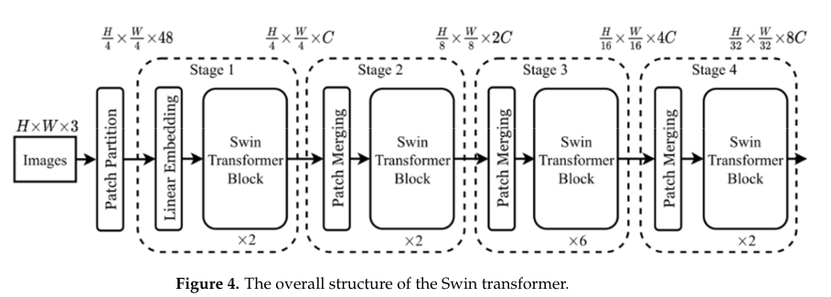
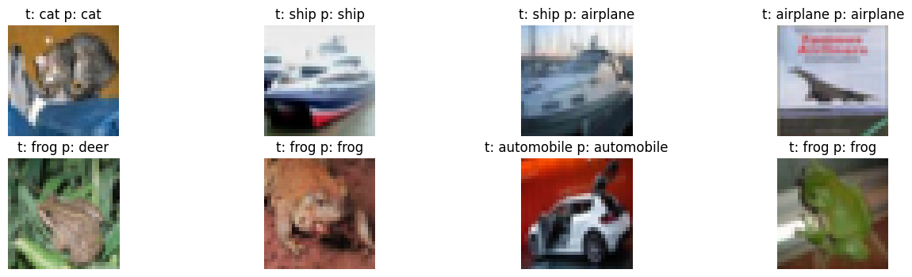

# Transformer from scratch
Aim: building a visual Swin Transformer for predicting CIFRA10 data set from sratch.

Method:

+ Multi_head_attention: Dot products between Queries and Keys are calculated. The results are pass through a softmax function to get an attention weights, which are used for a weighted sum of Values. The Values from all heads are linearly combined for an output Values.

+ The transformer block architecture is coded as the following image (https://www.mdpi.com/2072-4292/14/22/5806):

+ The image are devided into multi patchs of size 4x4 8x8 16x16 at different levels to reduce the complexity of a vanilla transformer approach (Swin Transformer architecture):

+ Position encoding was done using sin and cos approach.

Result:

